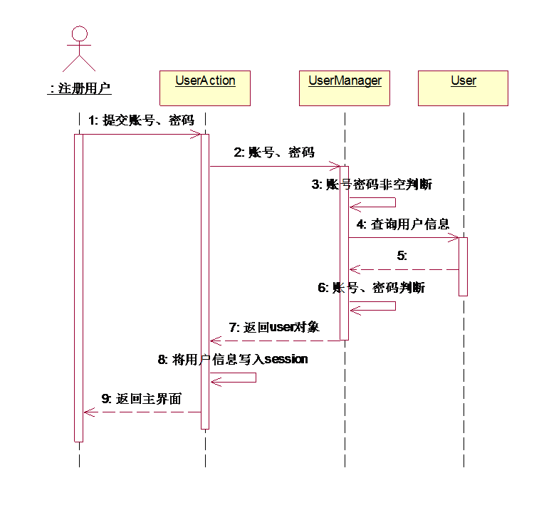
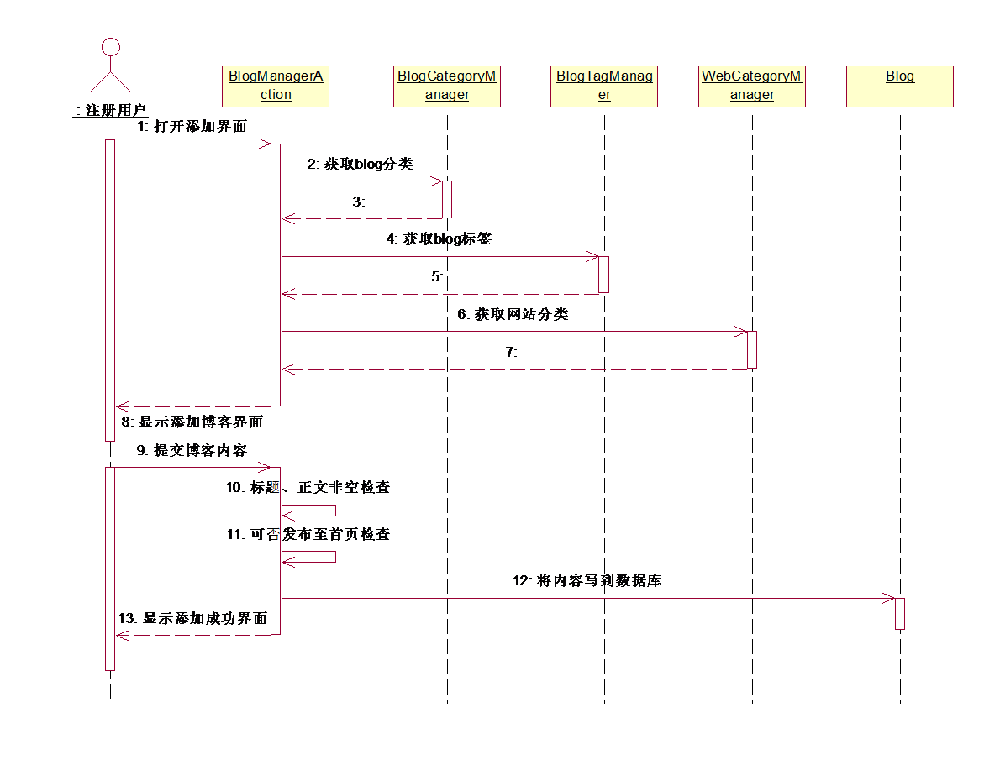
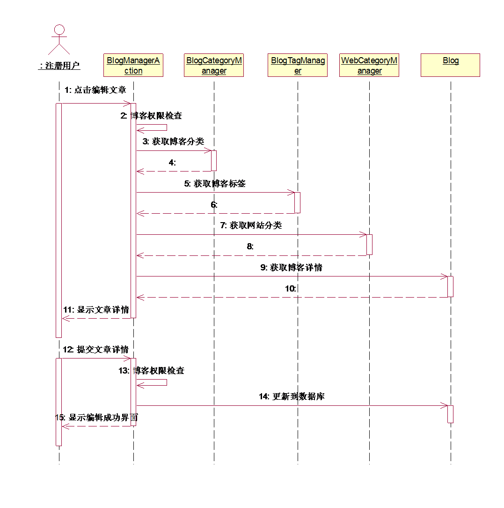

说明！：以下时序图写的是**博客系统**，请根据实际项目进行更改！别想当然复制粘贴。

### 登陆模块

登陆一般有以下步骤：

1. 提交账号和密码信息
2. 服务器端教研账号和密码的合法性
3. 根据username获取用户信息
4. 判断账号和密码是否一致
5. 返回结果

### 添加博客模块

添加博客有以下几个步骤：

1. 打开添加界面
2. 初始化自定义信息（博客分类、博客标签）和网站分类信息
3. 返回添加界面
4. 提交博客能容
5. 有效性检验
6. 将内容写到数据库
7. 返回添加结果

### 编辑博客模块

编辑博客模块有以下几个步骤

1. 点击编辑文章
2. 博客权限校验
3. 初始化自定义信息（博客分类、博客标签）和网站分类信息
4. 返回编辑界面
5. 提交博客能容
6. 有效性检验和博客权限校验
7. 将内容写到数据库
8. 返回添加结果

### 引用链接：

[YY博客园UML类图之博客模块](http://www.cnblogs.com/rwxwsblog/p/4533086.html?spm=a2c4e.11153940.blogcont389013.10.71832b80JZucZa)

[YY博客园UML时序图之博客模块](https://yq.aliyun.com/articles/389013)

[YY博客园UML用例图-活动图-状态图之博客模块](http://www.cnblogs.com/rwxwsblog/p/4536592.html?spm=a2c4e.11153940.blogcont389013.9.71832b80JZucZa&file=4536592.html%20)

